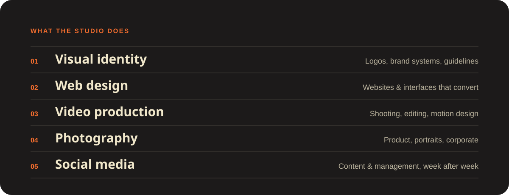

 

I'm **Théo**, a Swiss designer, illustrator and creative director. I founded **[Kaury Studio](https://kaury.studio)** in Vevey to give brands real character: identity, websites, video, photography and social media, all under one roof. I work hands-on on every project.

This GitHub is where the code side lives: the studio's websites, client portals and the small tools I build to work faster.

 

 

### 🟠 Currently

- Running **[Kaury Studio](https://kaury.studio)**, the creative studio in Vevey and Châtel-Saint-Denis
- Building the studio's websites and client portal
- 🚀 **HugoBoost**, a productivity booster app for Windows

### 🟠 Toolbox

**Design** &nbsp;`Illustrator` · `Photoshop` · `InDesign` · `Figma` · `After Effects` · `Premiere Pro` 
**Code** &nbsp;&nbsp;&nbsp;`HTML` · `CSS` · `JavaScript` · `Astro` · `React` · `Node.js` · `PHP` · `Python`

 

 

<picture>
  <source media="(prefers-color-scheme: dark)" srcset="https://raw.githubusercontent.com/theoblondel/theoblondel/output/snake-dark.svg">
  
</picture>

### 🟠 Let's talk

> Create until your ideas feel real.
