<!-- Visuals live in assets/ — regenerate them with: python3 scripts/build_assets.py -->

<p align="center">
  
</p>

<p align="center">
  <a href="https://github.com/theoblondel">
    
  </a>
</p>

<p align="center">
  <a href="https://www.kauryui.org"></a>
  <a href="https://github.com/theoblondel?tab=repositories"></a>
  
</p>

<br />


```ts
const theo = {
  based:     "Switzerland 🇨🇭",
  role:      "Mediamatician · Creative technologist",
  loves:     ["UI/UX", "branding", "web apps", "motion design", "automation"],
  building:  ["KauryUI", "HugoBoost", "short films & posters"],
  mindset:   "if it doesn't look good, it's not done",
  currently: "shipping demos you can click, not just screenshots",
};
```

<br />


<p align="center">
  <a href="https://www.kauryui.org"></a>
  <a href="https://github.com/theoblondel"></a>
  <a href="https://github.com/theoblondel/KinyTimer"></a>
  <a href="https://github.com/theoblondel/KryptHash"></a>
  <a href="https://github.com/theoblondel/pi-drop"></a>
  <a href="https://github.com/theoblondel/KAuth"></a>
</p>

<br />


<p align="center">
  <br />
  
</p>

<br />



<p align="center">
  
  
</p>

<p align="center">
  
</p>

<p align="center">
  
</p>

<p align="center">
  <picture>
    <source media="(prefers-color-scheme: dark)" srcset="https://raw.githubusercontent.com/theoblondel/theoblondel/output/snake-dark.svg" />
    <source media="(prefers-color-scheme: light)" srcset="https://raw.githubusercontent.com/theoblondel/theoblondel/output/snake.svg" />
    
  </picture>
</p>

<br />


<p align="center">
  Got a product that deserves to <b>look</b> as good as it <b>works</b>? A demo to ship, a brand to shape, a workflow to automate?<br />
  Open an issue on one of my repos or reach out through <a href="https://www.kauryui.org">kauryui.org</a> — I answer fast. ⚡
</p>

<p align="center">
  <a href="https://buy.stripe.com/5kAaIo03wgAb2S4aEW"></a>
</p>

<p align="center">
  
</p>
